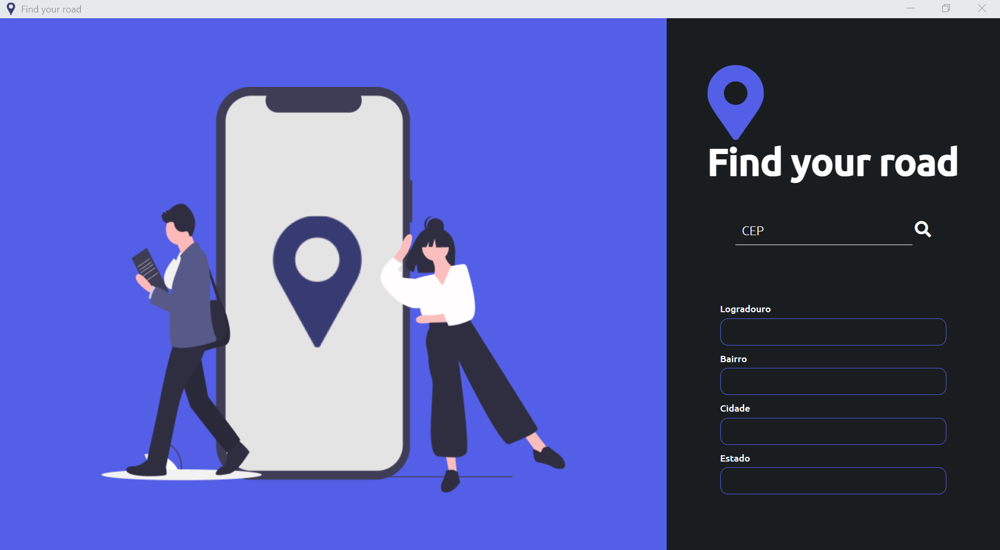
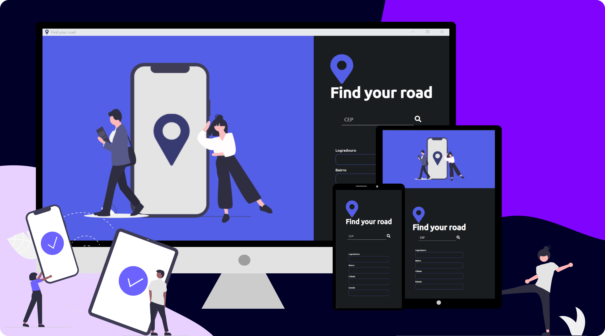

# 
 Address Finder 

  

## About:
First Project developed to learn about API with fetch.

Basically you just have to insert a zipcode and wait a request. If positive, all address informations will be displayed. If not, a modal will appear sending an error.

For an interactive layout, a picture of each state will appear.

## Features:

- [x] Zip code searching;
- [x] Interactive layout with photo;
- [x] Resposive webpages;

## Responsive Layout:

  

## Main Challenges:
- Learn how APIs works;
- How to apply JSON;
- Method get, mode cors, cache default;
- How to build arrow functions;
- Css grid layout

## Skills:

